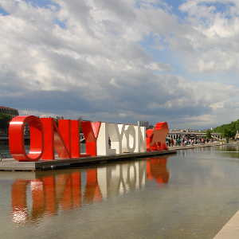
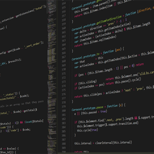



            

                

                    <h3 class="elevated-title section-subheading text-muted">My name is Robert Kalna, here is a quick summary about what I have been up to</h3>
                

            

            

                

                    <ul class="timeline">
                        <li>
                            

                                
                            

                            

                                

                                    <h4>2017 </h4>
                                    <h4 class="subheading">MSc in  Computer Science</h4>
                                

                                

                                    
Will be studying at <a href="https://www.univ-lyon1.fr/en/">University of Lyon 1</a> starting September

                                

                            

                        </li>
                        <li class="timeline-inverted">
                            

                                
                            

                            

                                

                                    <h4>2016 - 2017</h4>
                                    <h4 class="subheading">Studied french</h4>
                                

                                

                                    
Moved to Lyon, France in October 2016, have been studying french ever since.

                                

                            

                        </li>
                        <li>
                            

                                
                            

                            

                                

                                    <h4>2015 - 2016</h4>
                                    <h4 class="subheading">Software developer at <a href="https://www.prisetools.com/">Prise Ltd.</a></h4>
                                

                                

                                    
Mainly Java and Teradata SQL related projects

                                

                            

                        </li>
                        <li class="timeline-inverted">
                            

                                
                            

                            

                                

                                    <h4>2012 - 2015</h4>
                                    <h4 class="subheading">BSc Mathematics pure</h4>
                                

                                

                                    
Studied at <a href="https://www.bme.hu/?language=en">Budapest University of Technology and Economics</a>, science department, also wrote a thesis: "On automorpism groups of fraisse limits" (<a href="../resources/abstract_on_automorphisms_of_Fraisse-limits.pdf">abstract</a>)

                                

                            

                        </li>
                    </ul>
                

            

        





<h1 class="about-subtitle">More Information </h1> 

  
<h3>my ambitions (time of writing: 2017)</h3>

  

Well, first of all I want to be a good father. The rest is flexible, but I really am enjoying software development, so professionally I will stay on this course. I hope to work on software which can be used in education. I am from Budapest, Hungary, and I always felt that schools and teacher should rely more on technology there, not sure how it is elsewhere. I wish to contribute to this domain, but I still need to study a little before I start taking this seriously. However, what I love is solving problems, so even if it's not education related I am really happy to work on something interesting. 

Furthermore, I love learning languages, I still want to learn a few; Japanese, Spanish, a sign language for sure, and there are other that I am considering like Dutch, Chinese, maybe Arabic. Of course I need somehow not to forget how to use the languages that I already speak...so it's quite a challenge, but I love it.

So I am passionate about learning, getting to know a system which was unknown to me before. I would like to study someday philosophy and linguistics as well.

Finally, I really want to live in Japan for a year or so. I have already been there once, but I want the full experience, I want to explore japan, and talk to people there. 

  

  

<h1 class="about-subtitle"> my personal map</h1>

<iframe src="https://www.google.com/maps/d/embed?mid=1IbXQEV-wQXZZis42xlZOdhnQGGo&z=1.2&c=45.635418,20.469864" width="100%" height="300px"></iframe>

<h1 class="about-subtitle"> see when I am available</h1>

<iframe src="https://calendar.google.com/calendar/embed?mode=WEEK&height=600&wkst=2&bgcolor=%23FFFFFF&src=kalnarobert%40gmail.com&color=%23AB8B00&src=9hslc9chvt2gdr7qn2qloh5sk71b9klf%40import.calendar.google.com" style="border-width:0" width="100%" height="600" frameborder="0" scrolling="no"></iframe>



